# Claude Code Workflow

This repo ships a set of [Claude Code](https://claude.com/claude-code) slash commands, agents,
rules, and skills under `.claude/` that implement an Idea → PRD → ADR → Spec → Plan →
Implement → Test → Review pipeline for non-trivial features. Use it when a change is big enough
to deserve a written PRD/ADR/Spec; skip it for small, obvious fixes (just follow
[Contributing](contributing.md) directly).

```mermaid
flowchart LR
    A["/scope"] --> B["docs/prd/PRD-*.md"]
    B --> C["/architect"]
    C --> D["docs/adr/NNNN-*.md"]
    D --> E["/spec"]
    E --> F["docs/specs/spec-*.md"]
    F --> G["/swarm-plan"]
    G --> H["docs/plans/plan-*.md"]
    H --> I["/swarm-execute or /builder"]
    I --> J["code + tests"]
    J --> K["/qa-engineer"]
    K --> L["/code-review"]
```

## Steps

| Step | Command | Output |
|------|---------|--------|
| 1. Scope the idea | `/scope <feature description>` | `docs/prd/PRD-{slug}.md` |
| 2. Decide the approach | `/architect` | `docs/adr/{NNNN}-{slug}.md` |
| 3. Write the spec | `/spec docs/prd/PRD-{slug}.md docs/adr/{NNNN}-{slug}.md` | `docs/specs/spec-{slug}.md` |
| 4. Plan the work | `/swarm-plan` | `docs/plans/plan-{slug}.md` (+ Beads issues, see below) |
| 5. Implement | `/swarm-execute` or `/builder` | code + tests |
| 6. Verify | `/qa-engineer` | test coverage / manual verification notes |
| 7. Review | `/code-review` (this repo's native review skill) | review findings, ready to merge |

Each command asks clarifying questions one at a time (via `AskUserQuestion`) before writing its
artifact — answer them, or say "use your best judgment" to proceed with labelled assumptions.

## What's wired up vs. what's generic

- `/scope` and `/spec` are adapted to this repo's actual conventions: the `core`/`web` Spring-free
  split, the bytecode-only contract, the `MetricsExport` JSON envelope, and the
  `aic-check.yaml` gate pattern. They reference [Project Structure](project-structure.md) and
  [Contributing](contributing.md) conventions when filling PRD/Spec sections.
- `/architect`, `/builder`, `/qa-engineer`, `/swarm-plan`, `/swarm-execute`, and the
  `worker-*` agents were ported in unmodified — they're stack-agnostic.
- `/swarm-plan` and `/swarm-execute` track tasks via the external [Beads](https://github.com/steveyegge/beads)
  CLI (`bd`). It is **not installed in this repo's environment**; those steps will fail at the `bd`
  commands until it's installed separately. Use `/builder` directly (no Beads dependency) if you
  just want a single agent to implement a plan.
- `/code-review` is this repo's own existing skill (not part of the ported flow) — step 7 reuses it
  instead of a separate review command.

## Templates

The PRD/ADR/Spec/Plan templates live in `templates/artifacts/` (`prd.template.md`,
`adr.template.md`, `spec.template.md`, `plan.template.md`). Each command fills the template's
sections — don't invent a different structure when writing one of these artifacts by hand.

## Skills

Supporting skills under `.claude/skills/` back the commands above (architecture decisions, PRD
writing, TDD, refactoring, debugging, security review, task decomposition). They activate
automatically based on context — see each skill's `SKILL.md` frontmatter `description` for when
it applies. This repo's own `feature-dev` skill (`.claude/skills/feature-dev/SKILL.md`) still
governs day-to-day changes that don't go through the full PRD/ADR/Spec pipeline.
