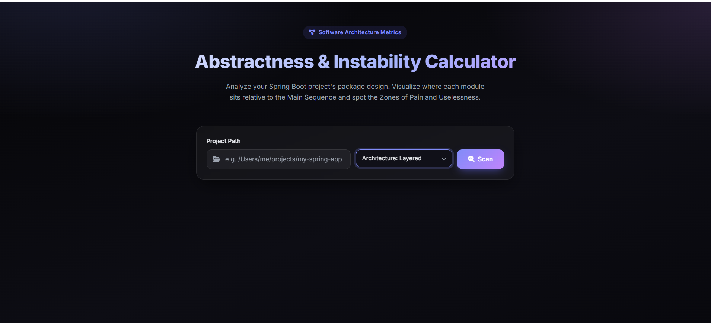
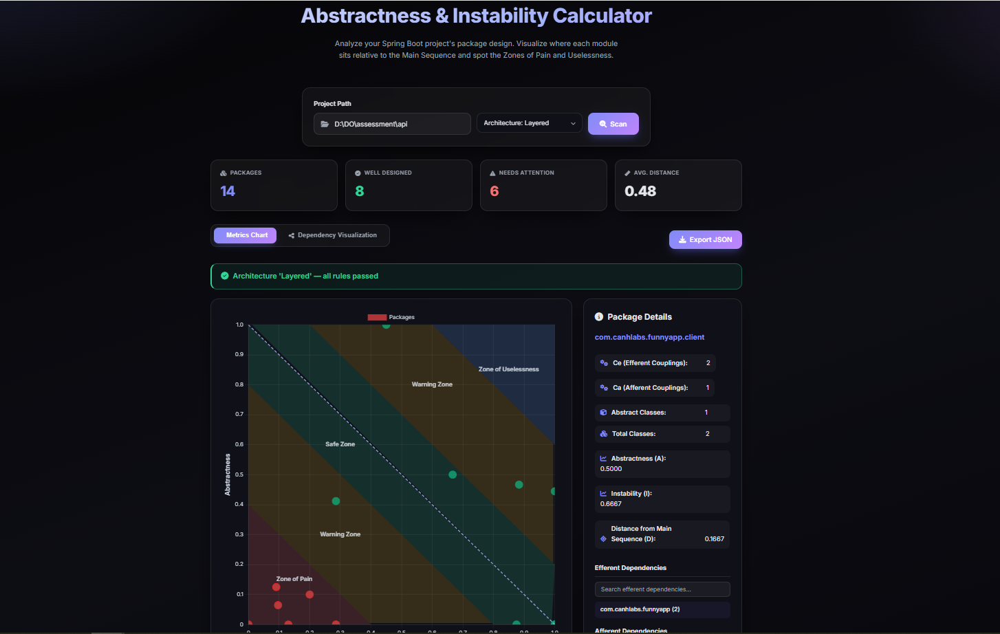
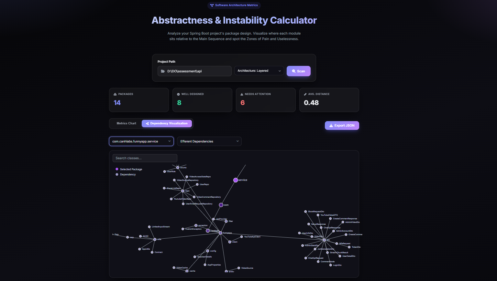

# Web UI

A tour of the web interface (`java -jar web/target/aic-web.jar`, then open <http://localhost:8081>).

## Scan a project

Enter the path to a **compiled** project, optionally pick an architecture template from the dropdown,
and click **Scan**.

## Metrics chart

After scanning you get summary cards (packages, well-designed, needs-attention, average distance), the
architecture banner (green when compliant), the abstractness vs. instability scatter plot with the
Main Sequence and the Pain/Uselessness/Safe/Warning zones, and a per-package details panel. Use
**Export JSON** to download the metrics envelope.

## Dependency visualization

The **Dependency Visualization** tab renders a force-directed graph of a selected package's efferent or
afferent dependencies.

